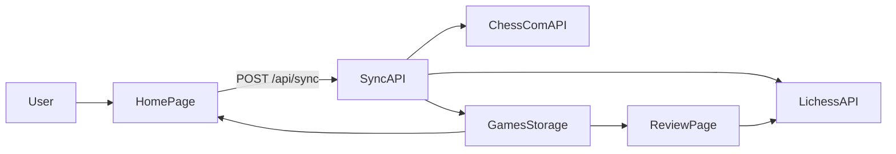

## Chess Game Review App

Automatically review your recent Chess.com games with free, full-game analysis from Lichess.

This app fetches your latest Chess.com games, imports them into Lichess using the official API (via the `equine` TypeScript SDK), and gives you a clean UI to browse and open each game’s analysis board.

---

### Overview

- **Problem**: Manually copying PGNs from Chess.com and pasting them into Lichess for analysis is tedious and easy to forget.
- **Solution**: A small Next.js app that:
  - Fetches your recent Chess.com games.
  - Imports unsynced games into Lichess.
  - Stores the results in a local JSON file.
  - Lets you browse your games and open each one’s Lichess analysis board.

**Core flow**:

1. Click **Sync Now** to call the sync API.
2. The server fetches your recent Chess.com games.
3. New games are imported into Lichess via `equine`.
4. Synced games are stored in `data/games.json`.
5. The UI shows a list of games; clicking one opens a detailed review page with an embedded Lichess board.

---

### Tech Stack

- **Framework**: Next.js 15 (App Router, TypeScript)
- **Language**: TypeScript (strict)
- **UI**: React 19 + Tailwind CSS v4
- **Lichess API**: [`equine`](https://github.com/devjiwonchoi/equine) TypeScript SDK
- **Data storage**: Local JSON file (`data/games.json`)

Key versions (from `package.json`):

- `next`: `^15.1.0`
- `react`: `^19.0.0`
- `react-dom`: `^19.0.0`
- `equine`: `^1.0.0-alpha.0`
- `tailwindcss`: `^4.0.0`
- `typescript`: `^5.7.0`

---

### Getting Started

#### Prerequisites

- **Node.js**: 18+ (recommended LTS)
- **npm**: 9+ (or the version bundled with your Node.js)

#### Installation

1. Clone the repository.
2. Install dependencies:

```bash
npm install
```

3. Create an `.env.local` file in the project root:

```bash
cp .env.local.example .env.local # if you create a template, otherwise create manually
```

4. Add the required environment variables (see below).

#### Environment Variables

Set these in `.env.local`:

```bash
CHESS_COM_USERNAME=your_chess_com_username
LICHESS_API_TOKEN=your_lichess_oauth_token_optional
NEXT_PUBLIC_CHESS_COM_USERNAME=your_chess_com_username
```

- **`CHESS_COM_USERNAME`**: Used by the server-side sync API to fetch your games from Chess.com.
- **`NEXT_PUBLIC_CHESS_COM_USERNAME`**: Used by the client-side UI to display your Chess.com profile link and context. The home page falls back to `"anewmatt"` if not set.
- **`LICHESS_API_TOKEN`** (optional but recommended):
  - If set, `equine` authenticates requests to Lichess and you get higher rate limits (about 200 imports/hour).
  - If omitted, imports run anonymously (about 100 imports/hour).

> Note: `.env.local` is git-ignored and should never be committed.

#### Development Commands

From the project root:

```bash
npm run dev        # Start dev server (http://localhost:3000)
npm run build      # Production build
npm run start      # Start production server (after build)
npm run lint       # ESLint
npm run type-check # TypeScript type-check (no emit)
```

---

### Usage

1. **Start the app**:

   ```bash
   npm run dev
   ```

   Open `http://localhost:3000` in your browser.

2. **Sync recent games**:

   - On the home page, click **“Sync Now”**.
   - This sends a `POST` request to `/api/sync`.
   - The server fetches your recent Chess.com games, imports new ones into Lichess, and stores them.
   - A status banner shows how many games were synced, skipped (already imported), and any errors.

3. **Browse games**:

   - The **Recent Games** list shows cards for each synced game.
   - Each card summarizes:
     - Your username, color, and result (win / loss / draw).
     - Opponent username and ratings.
     - Time control and time class badge (e.g., blitz, rapid, bullet, daily).
     - Date and time played.

4. **Review a game**:

   - Click a game card to navigate to `/review/[id]`, where `[id]` is the Lichess game ID.
   - The review page displays:
     - A large embedded Lichess analysis board (via iframe).
     - A sidebar with game details (players, ratings, results, time control, date).
     - Links to open the game on Lichess and Chess.com directly.

---

### Architecture & Data Flow

At a high level:

1. The **sync API** fetches recent games from Chess.com.
2. For each unsynced game, it imports the PGN into Lichess using `equine`.
3. The result (including Lichess IDs/URLs) is stored in a local JSON file.
4. The **games API** serves the stored games to the frontend.
5. The UI renders a game list and individual review pages with embedded analysis boards.

Key files:

- `app/page.tsx`: Client-side home page with **Sync Now** button and recent games list.
- `app/review/[id]/page.tsx`: Server component showing a single game’s analysis and metadata.
- `app/api/sync/route.ts`: `POST /api/sync` – syncs recent Chess.com games into Lichess and storage.
- `app/api/games/route.ts`: `GET /api/games` – returns the stored list of reviewed games.
- `lib/chess-com.ts`: Chess.com client (`getRecentGames`) using the public archives API.
- `lib/lichess.ts`: Lichess wrapper (`importGame`) using `equine`’s `gameImport`.
- `lib/storage.ts`: Local JSON storage utilities (`getGames`, `saveGame`, `hasGame`).
- `components/GameCard.tsx`: Renders a single game in the home page list.
- `components/AnalysisBoard.tsx`: Renders the embedded Lichess iframe and link.
- `data/games.json`: JSON array of all synced games (created automatically, git-ignored).

#### Data Flow Diagram



---

### APIs & External Services

#### Chess.com Public API

- **Base URL**: `https://api.chess.com/pub`
- The app uses:
  - `GET /player/{username}/games/archives` to get a list of monthly archive URLs.
  - Each archive URL returns a list of games with PGNs and metadata.
- Implemented in `lib/chess-com.ts`:
  - `getRecentGames(username: string, count = 10)`:
    - Fetches the archive list.
    - Loads up to the last two months of archives.
    - Aggregates games, sorts by `end_time` descending, and returns the most recent `count`.
    - Uses a custom `User-Agent` header (`ChessGameReviewApp/0.1 (personal review tool)`).

#### Lichess `gameImport` via `equine`

- The app uses the Lichess **game import** endpoint through the `equine` SDK.
- Implemented in `lib/lichess.ts`:
  - On first use, `ensureInitialized()` reads `LICHESS_API_TOKEN` (if provided) and calls `initialize(token)`.
  - `importGame(pgn: string)`:
    - Calls `gameImport({ body: { pgn } })`.
    - Extracts `id` and `url` from the response.
    - Builds an embed URL: `https://lichess.org/embed/game/{id}?theme=auto&bg=auto`.

**Rate limits** (approximate, per Lichess docs):

- **Authenticated** (with `LICHESS_API_TOKEN`): about **200 game imports/hour**.
- **Anonymous**: about **100 game imports/hour**.

The sync route adds a small delay between imports to help respect rate limits.

---

### Data Storage

- All synced games are stored in `data/games.json` at the project root.
- This file is created automatically on first use if it doesn’t exist.
- The structure is an array of `ReviewedGame` objects, which include:
  - Chess.com metadata (URLs, UUID, players, ratings, results, time control, time class, end time, PGN).
  - Lichess metadata (game ID, URL, embed URL).
  - Local metadata (`syncedAt` timestamp).
- Games are kept sorted by `endTime` descending (most recent first).

`data/` is git-ignored so your personal game history is not committed.

---

### Development Notes

- **TypeScript**: The project is configured with strict TypeScript settings.
- **Code organization**:
  - API integrations and storage live in `lib/`.
  - UI components in `components/`.
  - Routes and pages in `app/`.
- **Error handling**:
  - The sync API (`/api/sync`) returns structured errors if Chess.com or Lichess requests fail.
  - The home page surfaces sync status and error counts in a small banner.
  - The games API (`/api/games`) returns an error JSON payload with HTTP 500 on failure.

For more detailed project conventions and context, see `CLAUDE.md`.

---

### Future Improvements

Potential directions:

- Configure filters (time range, time control, rated vs unrated).
- Show opening names and ECO codes from PGN.
- Add tagging or notes per game.
- Add pagination or search for large game histories.
- Support multiple Chess.com usernames or profiles.

---

### License

TBD – add your preferred license here (e.g., MIT).

---

### Project Notes

This project started as a fun way to solve a personal problem: quickly reviewing my own Chess.com games with richer analysis, without the repetitive copy–paste shuffle between sites. It’s also an experiment in using Claude Code to drive the initial implementation and documentation.

